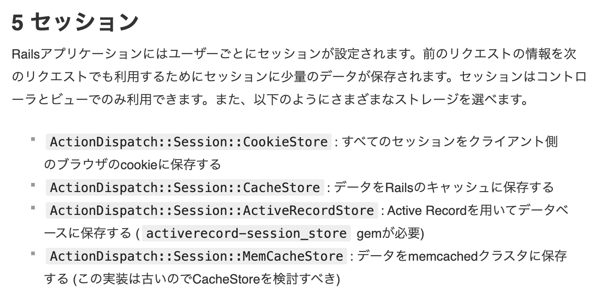
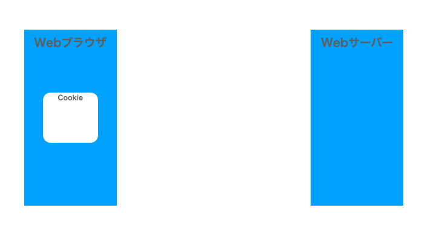
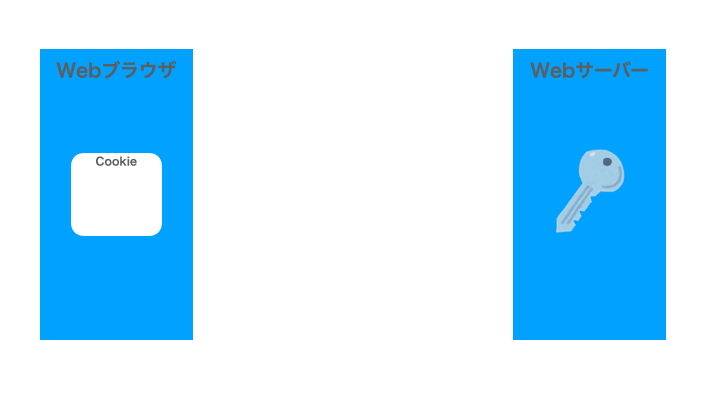
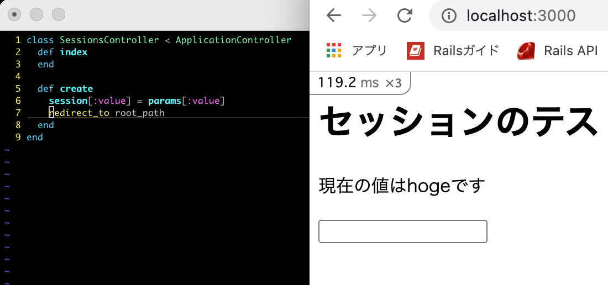
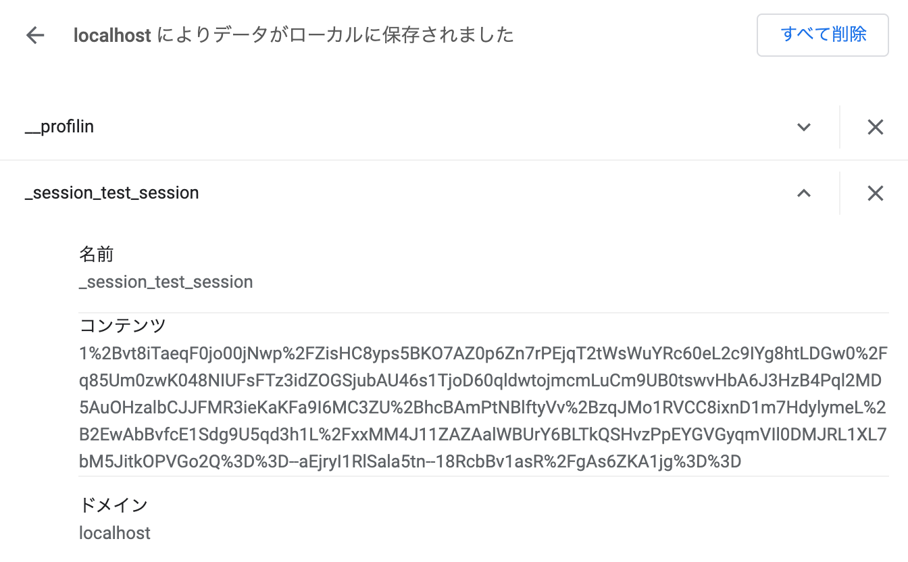
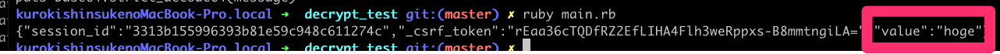
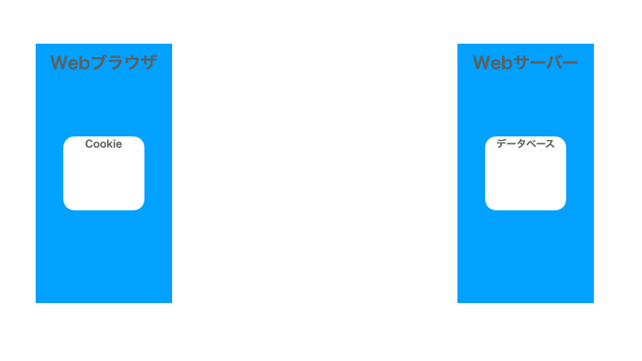
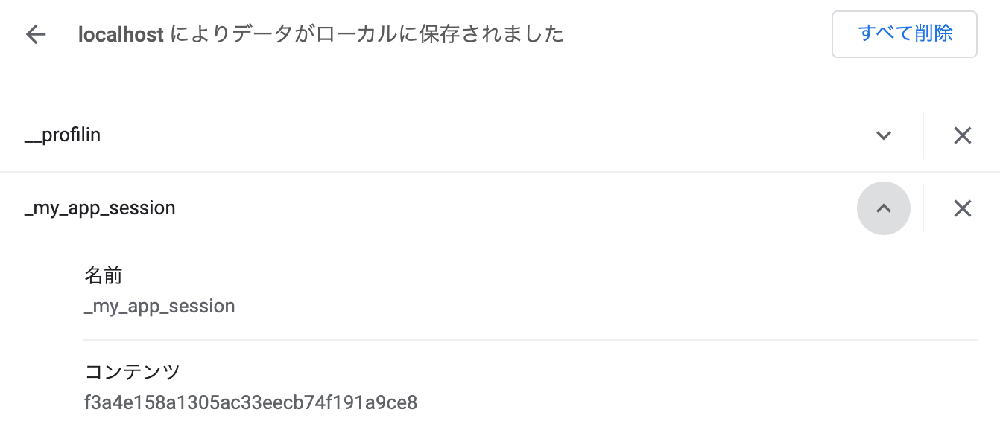
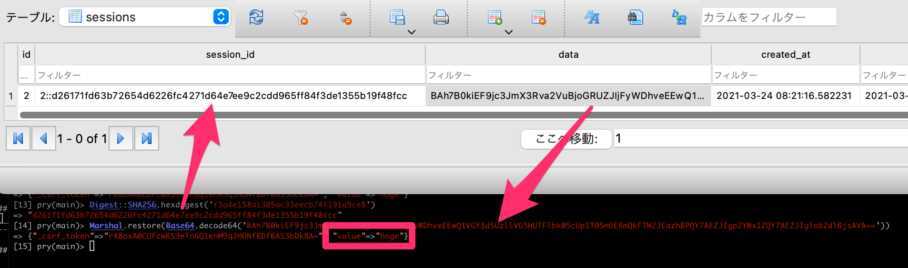

# Railsのセッションの話

## 2021/03/24 @Fukuoka.rb 200回 LT大会

黒木 慎介

---

## 自己紹介

- RubyとRails（など）で仕事してます
  - 2010-
- プログラミングを教える仕事も
  - 2019-
- 福岡県民
  - 1981-2007, 2019-
  - 今は福岡市東区箱崎に住んでます
- これから時々お邪魔したいなと思っています、今日はその挨拶も兼ねて

---

## Fukuoka.rb 200回 おめでとうございます！！


---

## このスライドについて

- 公開します
- もっと細かい版を後日Qiitaの記事にしたい
- 動作確認はRuby3.0+Rails6.1で行いました

---

## 目次

- このスライドの問題意識と目的
- Railsのセッションって何なの？
- CookieStoreを使う場合の動き
- ActiveRecordStoreを使う場合の動き
- （時間があったら）余談

---

## このスライドの問題意識と目的

- Railsのセッションって、初学者にとってはわかりにくい気がする
- 「セッションのデータはサーバー側に保存される」みたいな、完全に間違いではないのだけど誤解を生みそうな説明がされていることがある
- ちょっと丁寧めの解説をしてみたい

---

## Railsのセッションって何なの？（まとめを先出し）

- ブラウザごとに持つデータ
- ブラウザの個体認識はcookieに渡した鍵で行う
- **データ本体の所在はrailsアプリの設定で変えられる**
  - デフォルトではcookieにデータも置く
- ユーザーがその値を見たり、勝手に変更できない
  - なので、最初は「サーバー側に保存される」と考えていてもそれほど支障がない

---

## Railsガイド曰く、



https://railsguides.jp/action_controller_overview.html#%E3%82%BB%E3%83%83%E3%82%B7%E3%83%A7%E3%83%B3

---

## ？

- どういう動きをしているのかイメージするのは難しい
- 実際見ていきましょう
- 今日は2つのパターンを見ます

---

## その前に復習：Cookieの動作

- どの方式でもCookieは使う
- ブラウザが保存しているデータ
  - 送信先ごとに
- サイズに制限がある
- HTTPレスポンスの中に「これをcookieに保存して」と書かれていたら、その内容を保存する
- 送信するHTTPリクエストに、保存されているcookieの内容を入れて送る

---

## その前に復習：Cookieの動作



---

## CookieStore（デフォルト）の場合

- 暗号化したセッションのデータをcookieに保存
- rails newして設定を変えなかったらこの方式になる
- サーバー側で保存場所を用意しなくて良い

---

## CookieStore（デフォルト）の場合



---

## 簡単なテストプログラム



---

## 暗号化されて保存されているセッションのデータ



---

## これをこのようなコードにかけると…

```ruby
require 'cgi'
require 'openssl'
require 'base64'
require 'json'

# 暗号化の鍵、これが利用者にもれたらダメ
secret_key_base = '534e50c3c06e019ddfa95d36cea714786d3b09df460e05c32bf5c91dc9d33f6bde2e63ee55dec9ad3c61f29974f802dc422a74d6f2c5931abe59cd32948a0780'
salt = 'authenticated encrypted cookie'

# ブラウザに保存してあるcookie文字列
encrypted_session = CGI.unescape('aVCFHopZ4mS8L0atqkI4OeYUNEWjYBSPEZcAfjc%2F%2FOGT2%2BHzq1y%2FBlbGQhoLOprj5Jqan5zGV%2FYmglwL%2FKaTIfFx0zYq7RLSQ3nb7VTeQFLP8dNigQVPwfwy1nvxFu0C5j8r73TzrFaRP2LJ4oBbXI%2FAujWTOli21Eu8DCvmOGoUqF6IFUGGjHvZLvmjwclesiAJgEmQ8F11Z2JOgypaB4Tml5epzjnBHfl1djzdW2%2BLGtyACZWaaUkFE23lTCuMAvs9A9hyIGnT2%2BUe5U%2BjUi3c8CY95ckYrrmkT3Pkht0S2MJWUA3qtuaCHQ54kEPfDw%3D%3D--R6wkSNJzlN25MGkr--s0wLFfWuDPACSgogn127zQ%3D%3D')

#   len   = ActiveSupport::MessageEncryptor.key_len
cipher = OpenSSL::Cipher.new('aes-256-gcm')
len = cipher.key_len
#   key   = ActiveSupport::KeyGenerator.new('password').generate_key(salt, len) # => "\x89\xE0\x156\xAC..."
key = OpenSSL::PKCS5.pbkdf2_hmac(secret_key_base, salt, 1000, len, OpenSSL::Digest::SHA1.new)
#   crypt = ActiveSupport::MessageEncryptor.new(key)                            # => #<ActiveSupport::MessageEncryptor ...>
#   crypt.decrypt_and_verify(encrypted_data)                                    # => "my secret data"
encrypted_data, iv, auth_tag = encrypted_session.split("--").map { |v| ::Base64.strict_decode64(v) }

cipher.decrypt
cipher.key = key
cipher.iv  = iv
cipher.auth_tag = auth_tag
cipher.auth_data = ""

decrypted_data = cipher.update(encrypted_data)
decrypted_data << cipher.final
message = JSON.parse(decrypted_data)['_rails']['message']

puts Base64.strict_decode64(message)
```

---

## セッションの中身がわかっちゃう！



---

## CookieStoreの動作

- どうやって「ユーザーがその値を見たり、勝手に変更できない」ようにしているのか？
  - 暗号化によって
  - なので、鍵の情報が漏れるとだめ
    - secret_key_base, salt
    - 今のRailsの仕組みなら、よほどの事がない限りは大丈夫

---

## ActiveRecordStore

- cookieには鍵だけを保存
- DBに鍵とデータのペアを保存
- サーバー側で書き換えたりしやすい

---

## ActiveRecordStore



---

## 保存されているセッションのキー



---

## データベースの中身



---

## まとめ再掲

- ブラウザごとに持つデータ
- ブラウザの個体認識はcookieに渡した鍵で行う
- **データ本体の所在はrailsアプリの設定で変えられる**
  - デフォルトではcookieにデータも置く
- ユーザーがその値を見たり、勝手に変更できない
  - なので、最初は「サーバー側に保存される」と考えていてもそれほど支障がない

---

## 終わり

ありがとうございました

---

## 余談１：Railsのコードのどこを読んだか

- rails
  - [ActionDispatch::Request::Session](https://github.com/rails/rails/blob/6-1-stable/actionpack/lib/action_dispatch/request/session.rb)
  - [ActionDispatch::Session::CookieStore](https://github.com/rails/rails/blob/6-1-stable/actionpack/lib/action_dispatch/middleware/session/cookie_store.rb)
  - [ActionDispatch::Cookies::EncryptedKeyRotatingCookieJar](https://github.com/rails/rails/blob/6-1-stable/actionpack/lib/action_dispatch/middleware/cookies.rb#L630)
  - [ActiveSupport::MessageEncryptor](https://github.com/rails/rails/blob/6-1-stable/activesupport/lib/active_support/message_encryptor.rb)
  - [ActiveSupport::Messages::Metadata](https://github.com/rails/rails/blob/6-1-stable/activesupport/lib/active_support/messages/metadata.rb)
  - [ActiveSupport::KeyGenerator](https://github.com/rails/rails/blob/6-1-stable/activesupport/lib/active_support/key_generator.rb)
  - [Rails::Application](https://github.com/rails/rails/blob/6-1-stable/railties/lib/rails/application.rb)
- activerecord-session_store
  - [ActionDispatch::Session::ActiveRecordStore](https://github.com/rails/activerecord-session_store/blob/master/lib/action_dispatch/session/active_record_store.rb)
- rack
  - [Rack::Session::SessionId](https://github.com/rack/rack/blob/master/lib/rack/session/abstract/id.rb)

---

## 余談２：久々にやったコードリーディングで便利だったもの

- github（タグ機能でリーディングやりやすくなってた）
- pryのshow-source
- instance_eval(‘@xxx’)とか

---

## 合わせて読みたい

- [Railsセキュリティガイド](https://railsguides.jp/security.html)
- [安全なウェブサイトの作り方 - 1.4 セッション管理の不備](https://www.ipa.go.jp/security/vuln/websecurity-HTML-1_4.html)
